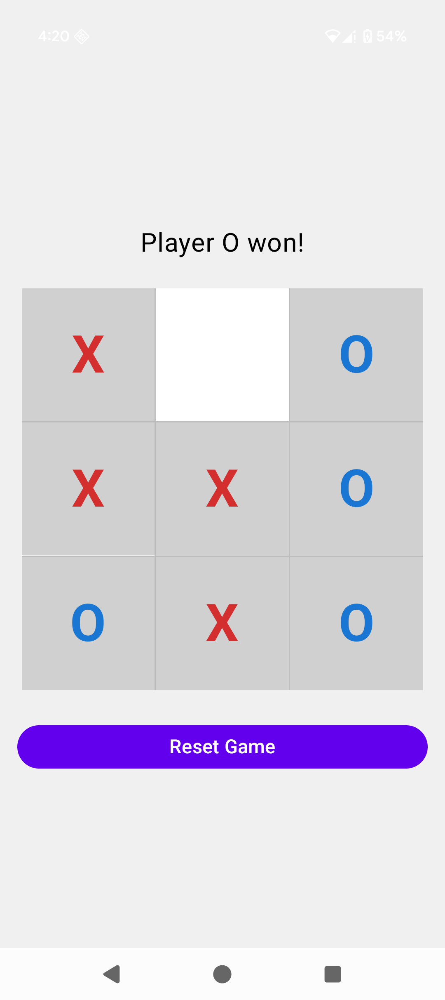
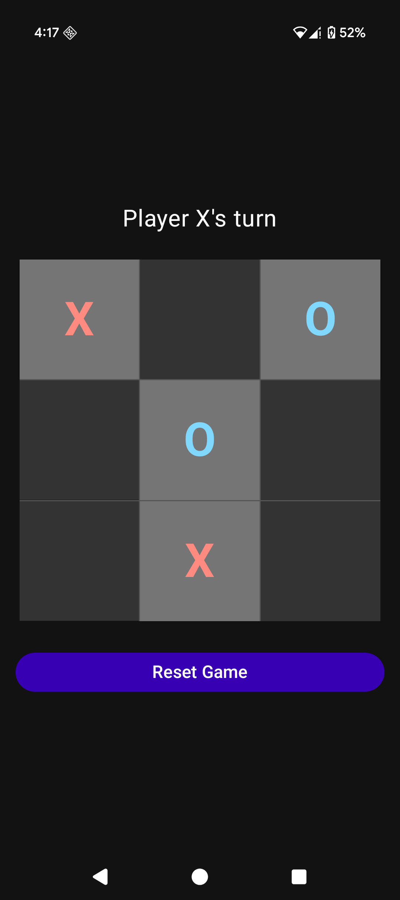

# TicTacToe

[](https://play.google.com/store/apps/details?id=com.krai29.tictactoe)

A classic Tic Tac Toe game developed for Android, showcasing modern Android development practices with Kotlin and Jetpack Compose.

## Overview

This project is a simple yet fully functional Tic Tac Toe game. It allows two players to compete on a 3x3 grid. The game features a clean user interface that supports both light and dark themes, ensuring a great user experience.

## Features

*   **Classic Tic Tac Toe Gameplay**: Play the timeless game of X's and O's.
*   **Player vs. Player**: Designed for two players on the same device.
*   **Dynamic Theming**: Automatically adapts to your device's light or dark theme settings.
*   **Responsive UI**: Built with Jetpack Compose for a modern and reactive user interface.
*   **State Management**: Utilizes `ViewModel` to manage UI-related data and game state robustly.
*   **Reset Functionality**: Easily start a new game at any point.

## Screenshots

<p align="center">
  
  &nbsp; &nbsp; &nbsp;
  
</p>

## Tech Stack

*   **Programming Language**: [Kotlin](https://kotlinlang.org/)
*   **UI Toolkit**: [Jetpack Compose](https://developer.android.com/jetpack/compose)
*   **Architecture**: MVVM (Model-View-ViewModel)
*   **Build Tool**: [Gradle](https://gradle.org/)
*   **Key Android Components**:
    *   `ViewModel` for state management.
    *   Material 3 Components for UI elements.
    *   Dark Theme support.

## How to Build

1.  **Clone the repository**:
    ```bash
    git clone https://github.com/krai29/TicTacToe.git
    ```

2.  **Open in Android Studio**:
    *   Launch Android Studio.
    *   Select "Open an existing Android Studio project".
    *   Navigate to the cloned/project directory and click "Open".

3.  **Sync Gradle**:
    *   Android Studio should automatically sync the project with Gradle. If not, click on "Sync Project with Gradle Files" (often an elephant icon in the toolbar).

4.  **Run the app**:
    *   Select an emulator or connect a physical device.
    *   Click the "Run" button (green play icon).

## Feedback and Contributions

Feedback and contributions are welcome! If you find any issues or have suggestions for improvements, please feel free to open an issue or submit a pull request.

---

